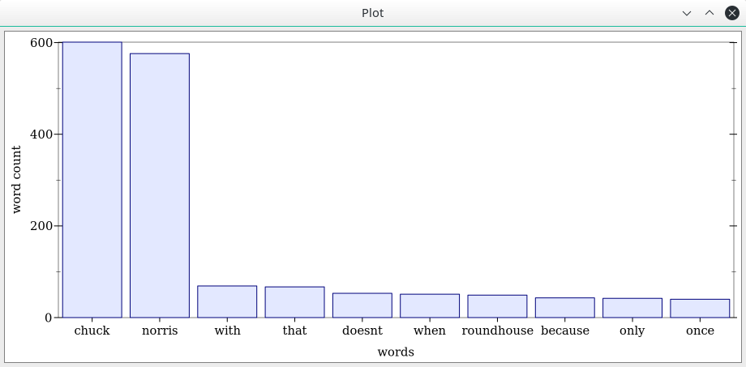

# chuck - simple experiment with racket

This program is totally useless experiment (rest/json consuming and plotting) on racket. 

Program:
- fetches and consumes rest/json data (http://api.icndb.com/jokes, chuck norris jokes db)
- calculates word frequencies
- presents the top ten most frequent words found in jokes using histogram



## usage
```
$ racket main.rkt
```
Opens window showing frequencies in histrogram.
